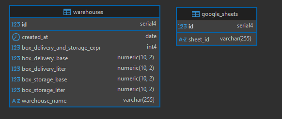

# Тестовое задание

## База данных

база данных - **PostgreSQL**

для подключения использовал **knexjs**

### Структура



- **warehouses**: таблица для хранения информации о складах.
- **google_sheets**: таблица для хранения id Google-таблиц, которые необходимо обновлять.

Так как количество таблиц может быть произвольным, они вынесены в отдельную таблицу в БД. Для управления таблицами добавлены эндпоинты для добавления, удаления и получения таблиц.

## API

После развертывания Swagger доступен по следующему адресу: [http://localhost:3000/api/docs](http://localhost:3000/api/docs).

## Таблицы

В задании не было сказано, поэтому я решил выгружать данные в таблицы так же каждый час, в текущей реализации было бы разумнее сделать один метод, который последовательно получает данные из API WB, а потом выгружает эти данные в таблицы, но так как неизвестно как часто обновлять таблицы я сделал методы раздельными.

- https://docs.google.com/spreadsheets/d/1ht3aaTljsffCJrEyzJTrwn5yNYXB26xmuE-gFVkUSH4/edit?gid=0#gid=0
- https://docs.google.com/spreadsheets/d/1JBKNpadGMQPsIPgHnuqnBYCZtupy0-bQIg42QOcUon8/edit?gid=0#gid=0
- https://docs.google.com/spreadsheets/d/1RjEGYExUtEFh55pOUzZ8AB_W6oOT_Nr79g-bimd-pac/edit?gid=0#gid=0

## Запуск приложения

1. Создать .env файл с переменными из .env.example

2. Приложение упаковано в Docker и запускается с помощью команды в корневой директории проекта:

```bash
docker compose up
```
